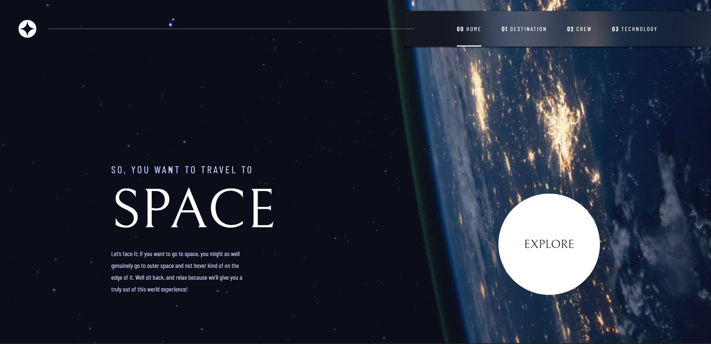

# Frontend Mentor - Space tourism website solution

This is a solution to the [Space tourism website challenge on Frontend Mentor](https://www.frontendmentor.io/challenges/space-tourism-multipage-website-gRWj1URZ3). Frontend Mentor challenges help you improve your coding skills by building realistic projects. 

## Table of contents

- [Overview](#overview)
  - [The challenge](#the-challenge)
  - [Screenshot](#screenshot)
- [My process](#my-process)
  - [Built with](#built-with)
- [Author](#author)

## Overview

### The challenge

Users should be able to:

- View the optimal layout for each of the website's pages depending on their device's screen size
- See hover states for all interactive elements on the page
- View each page and be able to toggle between the tabs to see new information

### Screenshot

### Links

- Solution URL: [GitHub](https://github.com/Nico-2b/SpaceTourismMultipage.git)
- Live Site URL: [The Website](https://spacetourismmultisitebynicolasfanti.netlify.app/)

## My process
In addition to the challenges rules that I followed, I added a specific animation for each page! Go Check this!
### Built with

- Semantic HTML5 markup
- CSS custom properties
- Flexbox
- CSS Grid
- Vanilla JavaScript

## Author

- Frontend Mentor - [Nico-2b](https://www.frontendmentor.io/profile/Nico-2b)
- Instagram - [Nicolas Fanti](https://www.instagram.com/nicofanti_/?hl=fr)

